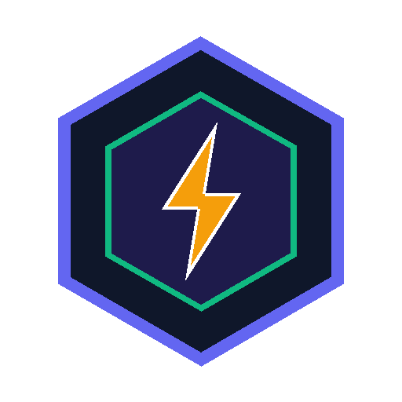

<p align="center">
  
</p>

<h1 align="center">Open Factory Agent｜開放工廠</h1>

<p align="center">
  <strong>100% 自由開源 · 本機自主工作流與 AI 智能工廠工作台</strong><br>
  <em>The Free &amp; Open-Source, Zero-Paywall Alternative to Flow Factory</em>
</p>

<p align="center">
  <a href="LICENSE"></a>
  <a href="https://python.org"></a>
  <a href="https://www.docker.com/"></a>
  <a href="https://unrealandychan.github.io/open-factory-agent/"></a>
  <a href="https://unrealandychan.github.io/open-factory-agent/app.html"></a>
</p>

---

## 🌐 產品展示與下載網頁 (Hosted Product Page)
👉 **[https://unrealandychan.github.io/open-factory-agent/](https://unrealandychan.github.io/open-factory-agent/)**  
👉 **[線上 1:1 介面體驗 (Live Web App Demo)](https://unrealandychan.github.io/open-factory-agent/app.html)**

---

## ⚡ 一鍵安裝與啟動 (One-Line Quick Install)

適用於 macOS 與 Linux：

```bash
curl -fsSL https://raw.githubusercontent.com/unrealandychan/open-factory-agent/main/install.sh | bash
```

安裝後即可在終端機直接使用：

```bash
open-factory-agent start    # 啟動並在瀏覽器開啟 http://127.0.0.1:8765/
open-factory-agent status   # 檢查運行狀態
open-factory-agent stop     # 停止服務
open-factory-agent restart  # 重新啟動
open-factory-agent update   # 更新至最新開源版本
```

---

## ✨ 核心特色 (Why Open Factory Agent?)

- 🔓 **100% 自由開源 (Zero Paywalls & No Subscription)**：
  徹底移除所有付費訂閱、Patreon OAuth、授權碼驗證及裝置數量限制。無限制建立工廠、流程與排程任務，永遠免費。
- 🖥️ **1:1 完整工作區介面 (Three-Pane Workspace)**：
  - **左側工廠導航 (Factory Sidebar)**：直觀的員工/工廠列表，即時狀態燈號、頭像與線上狀態。
  - **流程步驟卡片 (Flow Steps List)**：步驟類型徽章 (AI 生成 / 本機腳本)、執行順序與耗時統計。
  - **右側工作面板 (Workspace Panel)**：參數設定、執行模式切換、即時終端輸出串流 (Live SSE Logs)、產出文件即時預覽 (Markdown / JSON 樹狀檢視 / 原始文字)。
- 🤖 **無縫支援本機 AI Agent**：
  原生相容 **Hermes Agent**、**Pi Coding Agent**、**Claude Code CLI** 以及 **Ollama 本機模型**，透過標準本機 Webhook 自動分派與即時串流日誌。
- 🛡️ **本機隱私優先 (100% On-Device)**：
  所有工作流定義、Python 腳本、Prompt 提示詞與產出成果 100% 儲存在您的電腦，絕無外部遙測與資料外洩。
- 🐳 **完整 Docker 與 Makefile 支援**：
  提供生產級 `Dockerfile`、`docker-compose.yml` 與一鍵操作 `Makefile`。

---

## 🤖 連接本機 AI Agent (Local Agent Integration)

Open Factory Agent 透過本機 HTTP Webhook 與各類 Agent 溝通：

### 1. Hermes Agent
```bash
hermes agent start --webhook-port 8644
```

### 2. Pi Coding Agent
```bash
pi --listen-webhook 8644
```

### 3. Claude Code CLI
```bash
claude --server --port 8644
```

### 4. Ollama (本地離線模型)
```bash
ollama run qwen2.5-coder:14b
```

在 Open Factory Agent 網頁點擊「工作台設定 → Agent 設定」，確認 Webhook 目標設定為：  
`http://127.0.0.1:8644/webhooks/agent-task` 即可自動派工。

---

## 🐳 Docker 與 Docker Compose 快速啟動

使用 Docker 一鍵運行，環境無污染：

```bash
# 複製儲存庫
git clone https://github.com/unrealandychan/open-factory-agent.git
cd open-factory-agent

# 背景啟動
docker compose up -d

# 查看日誌
docker compose logs -f

# 停止容器
docker compose down
```

服務啟動後，在瀏覽器打開：`http://localhost:8765/`

---

## 🛠️ 開發者 Makefile 指令

本專案提供完整的 `Makefile` 管理所有工作流：

| 指令 | 說明 |
|---|---|
| `make run` | 背景啟動 Open Factory Agent 服務 |
| `make dev` | 前景互動式啟動服務 (方便除錯) |
| `make stop` | 停止本機運行的服務 |
| `make status` | 檢查服務運行狀態 |
| `make test` | 執行後端單元與整合測試 (Pytest) |
| `make docker-up` | 透過 Docker Compose 啟動容器 |
| `make docker-down` | 停止 Docker 容器 |
| `make build-pages` | 建置前端展示網頁 (`frontend/dist`) |
| `make clean` | 清除暫存快取、PID 檔案與記錄 |

---

## 📂 專案目錄結構 (Project Structure)

```
open-factory-agent/
├── index.html                   # 1:1 完整工作區 Web 介面 (零 DRM / 零付費牆)
├── server.py                    # 輕量本機高效能 Python 伺服器
├── scheduler.py                 # 工作流定時排程引擎
├── autostart.py                 # 系統開機自動啟動管理
├── workflows.default.json       # 預設開源工作流範本
├── start.sh / stop.sh           # 本機快捷啟動 / 停止腳本
├── install.sh                   # 一鍵 curl 安裝腳本
├── Dockerfile                   # 生產級容器定義
├── docker-compose.yml           # 容器編排設定檔
├── Makefile                     # 開發與維運快捷指令
├── assets/                      # 開源品牌圖標、員工頭像與辦公室元件
├── backend/                     # DDD 架構 FastAPI 後端與 Pytest 測試套件
├── frontend/                    # Vite + React + Tailwind 產品下載與展示網站
└── scripts/
    └── connect-agent.sh         # 本機 Agent 連線輔助診斷腳本
```

---

## ⚖️ 授權條款 (License)

本專案採用 **[MIT License](LICENSE)** 授權開放。  
由 **Eddie Chan ([@unrealandychan](https://github.com/unrealandychan))** 自由開源釋出。
